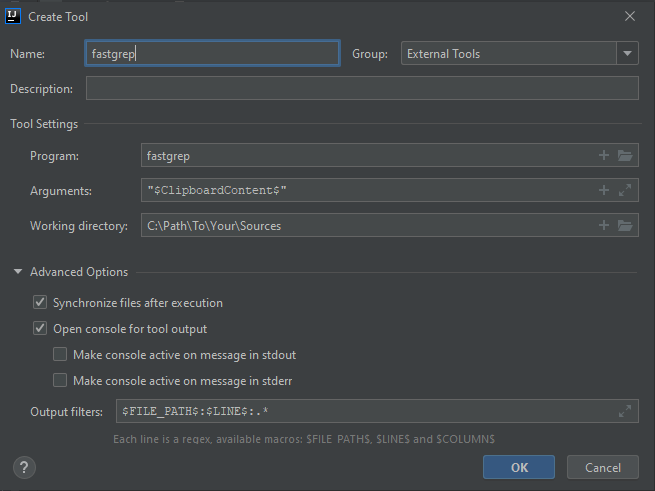
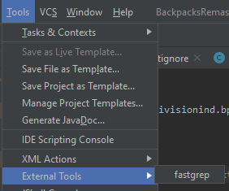
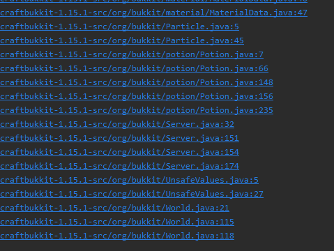
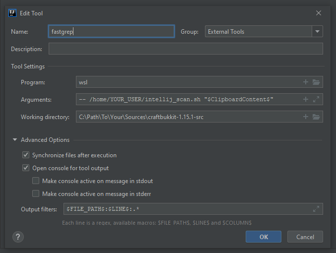

As an IntelliJ tool
-------------------

JetBrains IntelliJ has support for external tools. You can integrated fastgrep
into IntelliJ to allow for faster development. Included in this section are 
examples on how you could go about doing that.

### Steps (current)
1. Download the [latest](https://github.com/divisionind/fastgrep/releases) portable windows release or installer
2. Install or extract the portable release somewhere and add it to your system path
3. Go to `Settings->Tools->External Tools` and click the `+` icon
4. Fill in these parameters:



5. Now to use the script, copy the text `CTRL+C` you would like to search for and use the tool:



6. You will see an output of clickable links in the console to the sources containing the copied string.
Like this:



### Steps (<v1.5, e.g. outdated)
1. Ensure you have a wsl with fastgrep installed on your system
2. Go to `Settings->Tools->External Tools` and click the `+` icon
3. Fill in these parameters:



- `YOUR_USER` is your wsl username
- `C:\Path\To\...` is the path to the sources you would like to search (in this example,
  they are the decompiled Minecraft/craftbukkit server sources)
  
4. Next, create a script at `~/intellij_scan.sh` with the contents:
```shell script
#!/bin/sh
fastgrep $1 | sed -e 's/^/C:\/Path\/To\/Your\/Sources\/craftbukkit-1.15.1-src\//'
```
where again `C:\Path\To\...` is the path to your sources (excluding the escape chars).
A script is used here as the external tools feature of IntelliJ does not support UNIX
pipes for sending the output to sed.

5. Now to use the script, copy the text `CTRL+C` you would like to search for and use the tool:


6. You will see an output of clickable links in the console to the sources containing the copied string.
Like this:


_NOTE: There is currently a bug (as of IntelliJ 2020.1) which causes files to not be hyperlinked
if they are not already "viewed". Viewed meaning either the files are in the current project directory
or the directory of a project that was opened (and potentially closed) during the current lifetime of
the IDE's process._